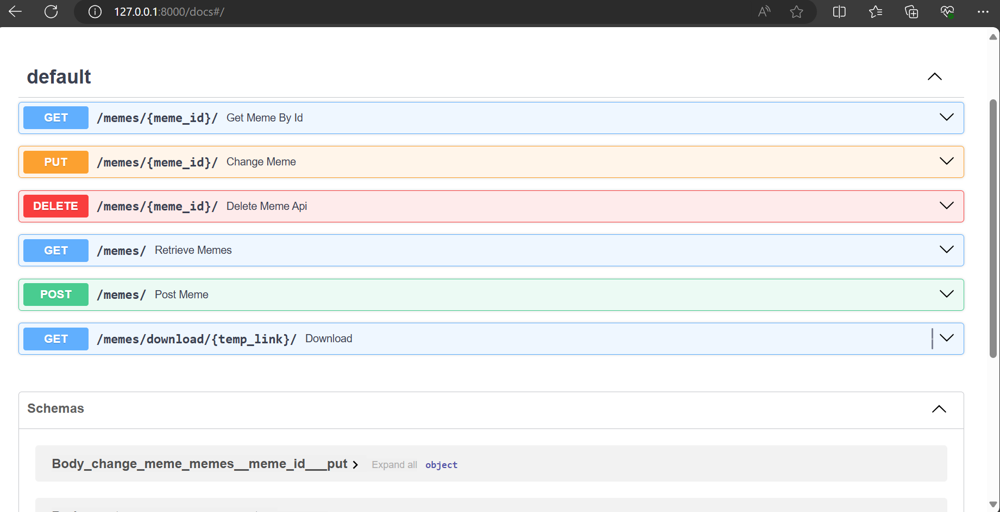
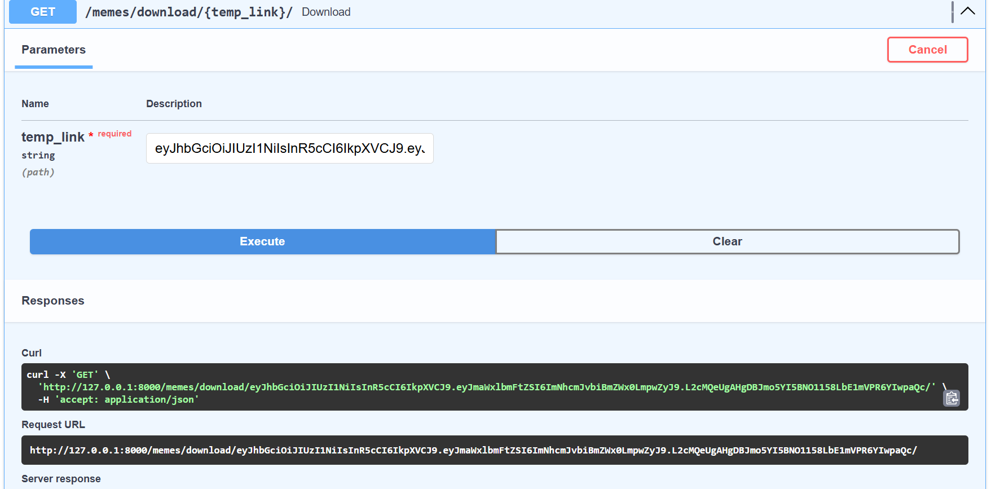
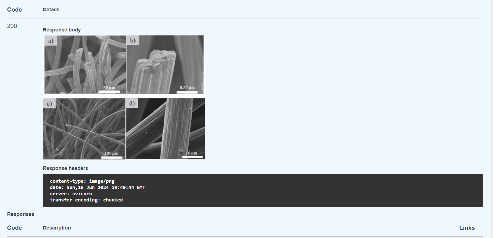

# memes_collection


## Описание проекта

Приложение позволяет пользователям загружать,
обновлять, смотреть и удалять мемы.

## Технологии

* FastApi
* Docker
* SQLAlchemy
* PostgreSQL
* pre-commit
* MinIO
* Alembic
* Pytest

## Как запустить проект:

Клонировать репозиторий и перейти в него в командной строке:

```bash
git clone git@github.com:YanaYugai/memes_collection.git
cd backend/
```

Cоздать и активировать виртуальное окружение:

 - Если у вас Linux/macOS:

```
python3 -m venv venv
source venv/bin/activate
```

 - Если у вас windows:

```
python -m venv venv
source venv/Scripts/activate
```

Установить зависимости из файла requirements.txt:

```
python3 -m pip install --upgrade pip
pip install -r requirements.txt
```

Прописать все необходимые переменные в .env:

Переменные, которые вам понадобятся:
1. MINIO_ROOT_USER (Логин для подключения к MinIO,
не меньше 3 символов)
2. MINIO_ROOT_PASSWORD (Пароль к логину для подключения к MinIO,
не меньше 8 символов)
3. BUCKET(Название бакета)
4. ENDPOINT(Хост для подключения к API Minio,
должен быть вида: name_container_minio_in_docker-compose: port,
в нашем случае: minio:9000)
5. API_ENDPOINT(Хост для подключения к приложению,
должен быть вида: host: port, в нашем случае: 127.0.0.1:8000)
6. JWT_SECRET(Секретный ключ для создания JWT токена)
7. DB_HOST(Хост на котором крутится база данных,
в нашем случае название контейнера с базой данных
в docker-compose : db)
8. DB_PASS(Пароль для пользователя базы данных,
должен быть в точности таким же как и POSTGRES_PASSWORD)
9. DB_NAME(Название базы данных,
должен быть в точности таким же как и POSTGRES_DB)
10. DB_PORT(Прокинутый порт для соединения с базой данных,
в нашем случае: 5432)
11. DB_USER(Пользователь базы данных, должен быть в точности
таким же как и POSTGRES_USER)
12. POSTGRES_USER(Пользователь базы данных)
13. POSTGRES_PASSWORD(Пароль для пользователя базы данных)
14. POSTGRES_DB(Название базы данных)

Если дефолтный порт базы данных у вас уже занят,
то необходимо исправить docker-compose.yml и
добавить новую переменную окружения:
`POSTGRES_PORT`.

Запустить локально docker compose:

 - Перейдите в директорию, где хранится docker-compose.yaml
 и выполните:

```bash
docker compose up --build -d
```

## Как запускать тесты:

После локального запуска проекта, можно запустить unit-тесты
для этого:

1. Перейдите в директорию с тестами.
2. Выполните команду:

```bash
pytest
```
После этого создастся локальная тестовая база данных sqlite и запустятся все тесты.

## Документация:

После запуска проекта вам будет доступна его документация
по адресу: http://127.0.0.1:8000/docs/






